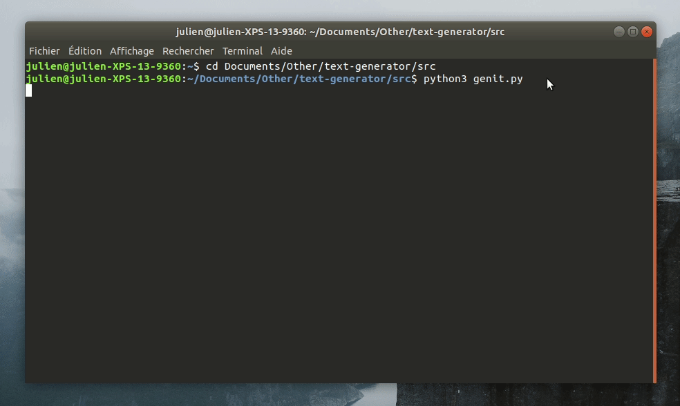

<h1 align="center">
  <br>
  </a>
  <br>
  <b>GenIt</b>
  <br>
</h1>

<h4 align="center">A funny text generator based on <a href="https://github.com/minimaxir/textgenrnn">textgenrnn</a>.</h4>

<p align="center">
  
  
  
</p>

<p align="center">
  <a href="#overview">Overview</a> •
  <a href="#how-to-use">How to use</a> •
  <a href="#credits">Credits</a> •
  <a href="#license">License</a>
</p>



## **Overview**

**[GenIt](https://github.com/jcordatauclair/text-generator)** is a command line tool that allows you to generate word sequences through machine learning on any text. It essentially uses **[textgenrnn](https://github.com/minimaxir/textgenrnn)** to generate results and several APIs to collect data that will later be used for training. So you can have fun creating improbable tweets that Donald Trump could have written or inventing crazy quotes from the famous Oscar Wilde. _There is no limit!_

```
"DO NOT TOUCH" would probably be a phone
The wall is the only solution for our country! MAKE AMERICA GREAT A WALL!
Hulk of the Galaxy: Return of the Sith (Part II)
```

Currently, it is possible to collect subreddit's titles from [Reddit](https://www.reddit.com/), tweets from [Twitter](https://twitter.com/), quotes from [Wikiquote](https://www.wikiquote.org/) and movies titles from [IMDb](https://www.imdb.com/). Local files are also supported if you want to experiment by yourself.

## **How to use**

The program only works with **version 3 of python** (textgenrnn requires it) and uses several modules indicated at the top of the `gen.py` script (which can be found in the source folder). Be sure to have them installed before running it:

```python
import praw                         # https://praw.readthedocs.io/en/latest/
import prawcore                     # https://pypi.org/project/prawcore/
import twitter                      # https://developer.twitter.com/en/docs.html
import wikiquotes                   # https://pypi.org/project/wikiquotes/
import imdb                         # https://media.readthedocs.org/pdf/imdbpy/latest/imdbpy.pdf

from textgenrnn import textgenrnn   # https://github.com/minimaxir/textgenrnn
from tqdm import tqdm               # https://github.com/tqdm/tqdm
from pyfiglet import Figlet         # https://github.com/pwaller/pyfiglet
from keras import backend as k      # https://keras.io/         
```

You will also need **credentials** if you want to retrieve data from Reddit or Twitter. Once you get them, create a `config.py` file in the source folder, copy and paste the code below and fill in the fields with your codes:

```python
# Reddit
reddit_client_id = 'YOUR_REDDIT_ID'
reddit_client_secret = 'YOUR_REDDIT_SECRET'
reddit_user_agent = 'YOUR_REDDIT_USER_AGENT'
reddit_username = 'YOUR_REDDIT_USERNAME'
reddit_password = 'YOUR_REDDIT_PASSWORD'

# Twitter
twitter_consumer_key = 'YOUR_TWITTER_ID'
twitter_consumer_secret = 'YOUR_TWITTER_SECRET'
twitter_access_token_key = 'YOUR_TWITTER_TOKEN_KEY'
twitter_access_token_secret = 'YOUR_TWITTER_TOKEN_SECRET'

```

Ater that, using this tool is quite simple. Just run the `genit.py` script with the following command, then proceed as described in the shell:

```
python3 genit.py
```

The calculation time can be quite long, especially if you want to have consistent results. But don't worry, **you won't be disappointed!**

## **Credits**

A huge thanks to [Max Woolf](https://github.com/minimaxir/) for sharing his **[textgenrnn](https://github.com/minimaxir/textgenrnn)** project! This is the basis of this tool.

## **License**

© **[Julien Cordat-Auclair](https://github.com/jcordatauclair)**
